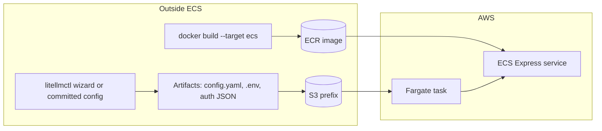

# LiteLLM proxy on Amazon ECS Express Mode (config outside the container)

[ECS Express Mode](https://docs.aws.amazon.com/AmazonECS/latest/developerguide/express-service-overview.html) deploys a Fargate service behind an ALB with minimal wiring. The **wizard is not run inside ECS**: you generate `config.yaml`, `.env`, and OAuth JSON files **locally or in CI**, store them in AWS (S3 and/or Secrets Manager), then start tasks that **mount or sync** those files into `/data` (`LITELLMCTL_HOME`).

## What lands in `/data`

| Artifact | Typical source |
|----------|------------------|
| `config.yaml` | Produced by `litellmctl wizard` (local/CI), stored in S3 or rendered in CI |
| `.env` | Secrets Manager → task environment variables **or** file in S3 prefix |
| `auth.*.json` | Same as `.env` (paths in `.env` must match filenames under `/data`) |

`.env.example` lists keys like `CHATGPT_AUTH_FILE=auth.chatgpt.json`; keep those files next to `config.yaml` under the same prefix when using S3.

## Pattern A — S3 prefix + task role (image: `--target ecs`)

1. **Build** the ECS image (includes `awscli` and `entrypoint-ecs.sh`):

   ```bash
   docker build -f docker/Dockerfile --target ecs -t $ECR_URI:latest .
   ```

2. **Publish config** to a private prefix, e.g. `s3://my-org-litellm/prod/`:

   ```text
   s3://.../prod/config.yaml
   s3://.../prod/.env
   s3://.../prod/auth.chatgpt.json
   ...
   ```

   CI can run `aws s3 sync` after the wizard step (non-interactive: commit a checked-in `config.yaml` or generate in a trusted runner).

3. **IAM (task role)** attached to the service: allow `s3:GetObject`, `s3:ListBucket` on that prefix (and KMS decrypt if the bucket uses SSE-KMS).

4. **Task environment** (Express console or API):

   - `LITELLMCTL_HOME=/data`
   - `LITELLM_ECS_S3_PREFIX=s3://my-org-litellm/prod/` (trailing slash optional; script syncs into `/data`)
   - `AWS_REGION` = bucket region

5. **Express Mode settings** when creating/updating the service:

   - **Container port**: `4000` (or set `PORT` in the task and match the port).
   - **Health check path**: `/health`.
   - **Command**: leave default (entrypoint runs `litellm`).

6. **No wizard in the cluster** — tasks only sync and start the proxy.

## Pattern B — Secrets Manager + environment variables (no files for secrets)

1. Store **sensitive** values in Secrets Manager (or SSM Parameter Store).
2. In the Express task definition, map each secret to an **environment variable** (`LITELLM_MASTER_KEY`, provider API keys, etc.).
3. For **OAuth JSON**, either:

   - Store each file body as a secret and use a CI step to write files before `docker build` (not ideal), or  
   - Prefer **Pattern A** for file-shaped secrets on S3 with tight IAM, or  
   - Use **EFS** (standard ECS task definition) to mount `/data` if Express customization allows a volume.

Express Mode exposes **Environment variables and secrets** in the console; use **Secret** as the value type and point to the Secrets Manager ARN.

## Pattern C — EFS mount

For teams that want a real POSIX mount instead of S3 sync:

- Provision **EFS** and mount it at `/data` in the task definition (often used with **non-Express** ECS services first; Express may evolve — confirm in current AWS docs whether Express task definitions support EFS).
- Populate EFS out-of-band (wizard on a bastion, backup restore, etc.).

The default image (`--target base`) expects files already present under `/data`; the **`ecs`** target adds S3 bootstrap only.

## CI pipeline (high level)



1. **Checkout** submodule `litellm` (required for `docker build`).
2. **Optional wizard job** (interactive only on a maintainer machine; in CI usually **skip** and use versioned `config.yaml`).
3. **Sync artifacts** to `s3://.../env-name/`.
4. **Build and push** `docker build -f docker/Dockerfile --target ecs -t $ECR:latest .`.
5. **Deploy** — update the Express service to the new image digest (console, CLI, or IaC).

## GitHub Actions

See `.github/workflows/litellm-ecr.yml` for an ECR push workflow (OIDC to AWS recommended). Wire a second job to call `aws ecs update-express-gateway-service` or your org’s deploy step once you have the Express service identifier from AWS.

## Operational notes

- **Port**: Default listener in Express may assume port `80`; set container port **4000** and map the target group accordingly, or set `PORT=80` and align health checks.
- **OAuth refresh**: Long-lived tokens in S3 are updated by a **scheduled job** or **manual** `aws s3 cp` after `litellmctl auth refresh` on a trusted host — not inside the running proxy task.
- **Cold start**: First task after deploy runs `aws s3 sync`; keep the prefix small and in-region to reduce latency.
